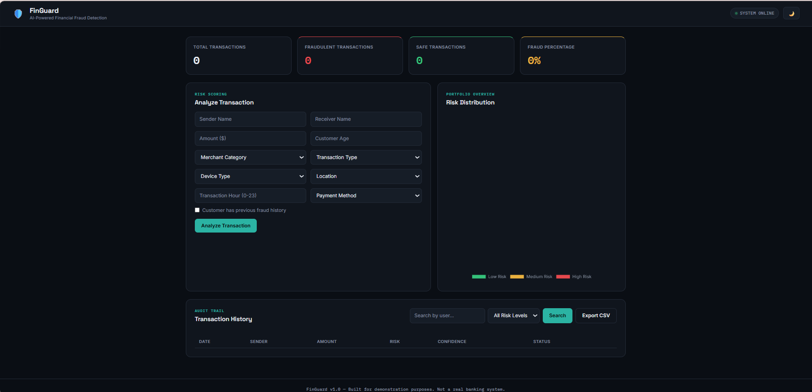
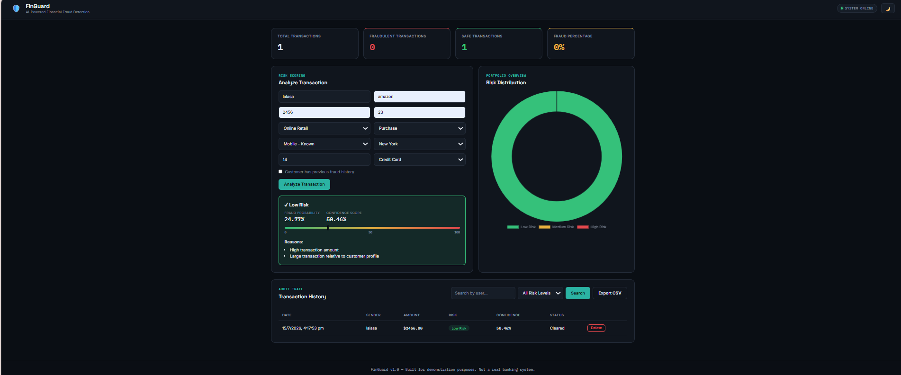
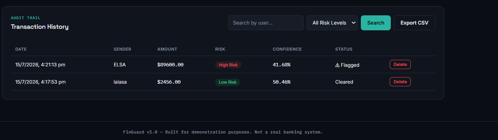

# 🛡️ FinGuard

## AI-Powered Financial Fraud Detection Platform

🚀 **Live Demo:**  

https://finguard-ai-fraud-detection.onrender.com

---

## 📖 Overview

FinGuard is a full-stack AI-powered web application designed to detect potentially fraudulent financial transactions in real time. It leverages Machine Learning to analyze transaction patterns, estimate fraud probability, and classify transactions into **Low**, **Medium**, or **High Risk** through an interactive dashboard.

The platform demonstrates the integration of Machine Learning, FastAPI, and modern web technologies to build an end-to-end fraud detection system suitable for banking and financial security applications.

> **Note:** The application is deployed on Render's free tier. The first request after inactivity may take approximately 30–60 seconds while the server wakes up.

---

## 🌐 Live Application

**Demo:**  
https://finguard-ai-fraud-detection.onrender.com

---

# ✨ Key Features

- 🤖 AI-powered fraud prediction
- ⚡ Real-time transaction analysis
- 📊 Fraud probability & confidence score
- 📈 Interactive analytics dashboard
- 🔍 Search and filter transaction history
- 📁 Export transaction history as CSV
- 📉 Risk distribution visualization
- 📌 Machine Learning model evaluation
- 🔗 RESTful APIs with FastAPI
- 💻 Responsive and modern UI

---

# 🖥️ Application Preview

> Add your screenshots inside the `screenshots/` folder.

### Dashboard



### Fraud Prediction



### Transaction History



---

# 🏗️ System Architecture

```
                User
                  │
                  ▼
      Frontend (HTML • CSS • JavaScript)
                  │
                  ▼
        FastAPI Backend (Python)
                  │
                  ▼
     Machine Learning Prediction Engine
                  │
                  ▼
          SQLite Database
```

---

# 📂 Project Structure

```
FinGuard-AI-Fraud-Detection
│
├── backend/
│
├── frontend/
│   ├── static/
│   └── templates/
│
├── models/
│   ├── artifacts/
│   └── data/
│
├── screenshots/
│
├── app.py
├── requirements.txt
├── README.md
└── .gitignore
```

---

# 🛠️ Technology Stack

## Backend

- Python
- FastAPI
- Uvicorn

## Frontend

- HTML5
- CSS3
- JavaScript

## Machine Learning

- Scikit-learn
- Pandas
- NumPy
- Joblib

## Database

- SQLite

## Visualization

- Matplotlib
- Seaborn

## Deployment

- Render
- GitHub

---

# 🤖 Machine Learning Pipeline

The fraud detection model is trained using transaction data containing financial and behavioral attributes.

### Features Used

- Transaction Amount
- Merchant Category
- Transaction Type
- Device Type
- Location
- Customer Age
- Payment Method
- Previous Fraud History
- Transaction Time

### Model Output

- 🟢 Low Risk
- 🟡 Medium Risk
- 🔴 High Risk

Each prediction includes:

- Fraud Probability
- Confidence Score
- Risk Level
- Prediction Explanation

---

# 📊 Model Performance

| Metric | Score |
|---------|------:|
| ROC-AUC Score | **0.96** |
| Fraud Recall | **0.74** |
| Fraud Precision | **0.44** |

Model evaluation includes:

- ROC Curve
- Confusion Matrix
- Feature Importance Analysis

---

# 🔗 REST API

| Method | Endpoint | Description |
|---------|----------|-------------|
| POST | `/api/predict` | Predict fraud risk |
| GET | `/api/dashboard` | Dashboard statistics |
| GET | `/api/transactions` | Retrieve transaction history |
| DELETE | `/api/transactions/{id}` | Delete transaction |
| GET | `/api/transactions/export` | Export CSV |
| POST | `/api/feedback` | Submit prediction feedback |

Interactive API Documentation:

```
/docs
```

---

# 🚀 Installation

Clone the repository

```bash
git clone https://github.com/ksnsrilasya/FinGuard-AI-Fraud-Detection.git
```

Navigate into the project

```bash
cd FinGuard-AI-Fraud-Detection
```

Install dependencies

```bash
pip install -r requirements.txt
```

Run the application

```bash
uvicorn app:app --reload
```

Open

```
http://127.0.0.1:8000
```

Swagger Documentation

```
http://127.0.0.1:8000/docs
```

---

# 📈 Future Enhancements

- User Authentication
- Role-Based Access Control
- Email Alerts
- PostgreSQL Integration
- Docker Containerization
- Cloud Deployment (AWS/Azure)
- Real Banking Dataset Integration
- Explainable AI (XAI)
- Continuous Model Retraining
- Admin Analytics Dashboard

---

# 🎯 Learning Outcomes

This project demonstrates practical knowledge of:

- Machine Learning
- Fraud Detection
- Data Preprocessing
- Model Evaluation
- FastAPI Development
- REST API Design
- Frontend Integration
- SQLite Database
- Git & GitHub
- Cloud Deployment using Render

---

# 👨‍💻 Author

## K S N Sri Lasya

**Computer Science Engineering (AI & ML)**

GitHub  
https://github.com/ksnsrilasya

LinkedIn  
https://www.linkedin.com/in/k-s-n-sri-lasya-a887113b3

---

# 📜 License

This project is developed for educational, research, and portfolio purposes.

---

⭐ If you found this project interesting, consider giving it a **Star**.
